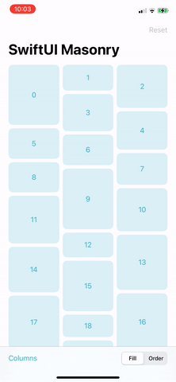

# SwiftUI Masonry

SwiftUI views that arrange their children in a Pinterest-like layout.



## HMasonry
A view that arranges its children in a horizontal masonry.

### Usage
```swift
ScrollView(.horizontal) {
    HMasonry(rows: 2) {
        //Masonry content
    }
}
```

### Parameters
* `rows`: The number of rows in the masonry.
* `spacing`: The distance between adjacent subviews, or `nil` if you want the masonry to choose a default distance for each pair of subviews.
* `content`: A view builder that creates the content of this masonry.

## VMasonry
A view that arranges its children in a vertical masonry.

### Usage
```swift
ScrollView(.vertical) {
    VMasonry(columns: 2) {
        //Masonry content
    }
}
```

### Parameters
* `columns`: The number of columns in the masonry.
* `spacing`: The distance between adjacent subviews, or `nil` if you want the masonry to choose a default distance for each pair of subviews.
* `content`: A view builder that creates the content of this masonry.

## Masonry
A view that arranges its children in a masonry.

### Usage
```swift
ScrollView(.vertical) {
    Masonry(.vertical, lines: 2) {
        //Masonry content
    }
}
```

### Parameters
* `axis`: The layout axis of this masonry.
* `lines`: The number of lines in the masonry.
* `spacing`: The distance between adjacent subviews, or `nil` if you want the masonry to choose a default distance for each pair of subviews.
* `content`: A view builder that creates the content of this masonry.

## Advanced Usage
The distance between adjacent subviews can be controlled in both axes, by using the `horizontalSpacing` and `verticalSpacing` parameters instead of the `spacing` parameter.

The `lines`, `columns` and `rows` parameters can be initialised with one of the `MasonryLines` cases:
* `adaptive`: A variable number of lines. This case uses the provided `sizeConstraint` to decide the exact number of lines.
* `fixed`: A constant number of lines.

Masonry views can be initialised with a data source using the `data` and `id` parameters, where `content` builds each child view dynamically from the data source. Using these initialisers also provides access to the `lineSpan`, `columnSpan` and `rowSpan` parameters; return an `Int` or a `MasonryLines` case to set the number of lines a child view will span across.

The `masonryPlacementMode` view modifier can be used to control how masonry views place their children. Provide a `MasonryPlacementMode` case:
* `fill`: Place each subview in the line with the most available space. This is the default behaviour.
* `order`: Place each subview in view tree order.

## Requirements

* iOS 14.0+, macOS 11.0+, tvOS 14.0+ or watchOS 7.0+
* Xcode 26.0+

## Installation

* Install with [Swift Package Manager](https://developer.apple.com/documentation/xcode/adding_package_dependencies_to_your_app).
* Import `SwiftUIMasonry` to start using.
