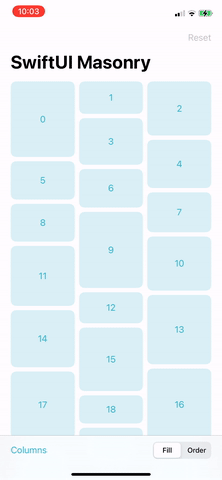

# SwiftUI Masonry
SwiftUI layouts that arrange their subviews in a Pinterest-like grid.



## VMasonry
A layout that arranges its subviews in a vertical masonry.

### Usage
```swift
ScrollView(.vertical) {
    VMasonry(columns: 2) {
        // Masonry content
    }
}
```

### Parameters
* `columns`: The number of columns in the masonry.
* `spacing`: The distance between adjacent subviews, or `nil` if you want the masonry to choose a default distance for each pair of subviews.

## HMasonry
A layout that arranges its subviews in a horizontal masonry.

### Usage
```swift
ScrollView(.horizontal) {
    HMasonry(rows: 2) {
        // Masonry content
    }
}
```

### Parameters
* `rows`: The number of rows in the masonry.
* `spacing`: The distance between adjacent subviews, or `nil` if you want the masonry to choose a default distance for each pair of subviews.

## Advanced Usage
`VMasonry` and `HMasonry` both conform to SwiftUI's [Layout](https://developer.apple.com/documentation/swiftui/layout) protocol. Use [AnyLayout](https://developer.apple.com/documentation/swiftui/anylayout) to switch between `VMasonry`, `HMasonry` or any other layout at runtime.

The distance between adjacent subviews can be controlled by using the `spacing` or `horizontalSpacing`/`verticalSpacing` parameters:
```swift
VMasonry(columns: 2, spacing: 12) {
    // Masonry content
}

// Or

VMasonry(columns: 2, horizontalSpacing: 8, verticalSpacing: 12) {
    // Masonry content
}
```

The `masonryColumnSpan`/`masonryRowSpan` view modifiers can be used to control the number of columns/rows a subview will span in a parent masonry layout. Subviews span 1 column/row by default:
```swift
VMasonry(columns: 3) {
    // Other masonry content

    MyCellView()
        .masonryColumnSpan(2)
    
    // Other masonry content
}
```

The `columns`/`rows` masonry parameters and `masonryColumnSpan`/`masonryRowSpan` view modifiers can either be provided with an `Int` or with a `MasonryColumnCount`/`MasonryRowCount` case:
* `adaptive`: A variable number of columns/rows. This case uses the provided constraint to decide the exact number of columns/rows.
* `fixed`: A constant number of columns/rows.

The `masonryPlacementMode` view modifier can be used to control how masonry layouts place their subviews. Provide a `MasonryPlacementMode` case:
* `fill`: Place each subview in the column/row with the most available space. This is the default behaviour.
* `order`: Place each subview in view tree order.

## Requirements
* iOS 16.0+, macOS 13.0+, tvOS 16.0+, visionOS 1.0+ or watchOS 9.0+
* Xcode 26.0+

## Installation
* Install with [Swift Package Manager](https://developer.apple.com/documentation/xcode/adding_package_dependencies_to_your_app).
* Import `SwiftUIMasonry` to start using.
